# DSA Automation

Submit a LeetCode solution, and a hosted FastAPI service turns it into a reviewed, well-documented entry in your DSA notes repo, with a Telegram ping when the draft is ready.

## How it works

```mermaid
flowchart LR
    A[LeetCode submit] --> B[LeetCode repo on GitHub]
    B -- push webhook, HMAC-verified --> C[FastAPI service]
    C --> D[Fetch problem metadata and classify into your folder structure]
    D --> E[Gemini generates missing Java/Python files and README]
    E --> F[(PostgreSQL drafts)]
    F --> G[Telegram message with review link]
    G --> H[Review page, password protected]
    H -- approve --> I[Commit to DSA notes repo via GitHub API]
```



## Stack
FastAPI, PostgreSQL (SQLAlchemy), GitHub Webhooks and REST API, Google Gemini (`google-genai`), Telegram Bot API, Docker.

## Design decisions
- **Webhook security:** every request is verified with an HMAC-SHA256 signature; bad signatures get 401.
- **Fast webhook response:** GitHub is acknowledged immediately; generation runs as a background task.
- **Duplicate protection:** repeated delivery IDs are ignored.
- **Human in the loop:** nothing is written to the notes repo until you approve a draft.
- **Protected dashboard:** review and backfill endpoints require HTTP Basic auth (denied if no password is set).
- **Classification** is rule-based (matching LeetCode topic tags against your existing repo folders). It does not invent folders.
- **Layered structure:** routers, services, models.

## Run locally
```bash
python -m venv venv && source venv/bin/activate   # Windows: venv\Scripts\activate
pip install -r requirements-dev.txt
cp .env.example .env        # fill in values
uvicorn app.main:app --reload
pytest
```

## Deploy (Render + Neon)
1. Create a free Postgres database on Neon and copy its connection string into `DATABASE_URL`.
2. Push this folder to a GitHub repo. In Render choose New > Blueprint (it reads `render.yaml`) or New > Web Service with Docker.
3. Add every variable from `.env.example` in Render's Environment tab.
4. Set `PUBLIC_BASE_URL` to your Render URL.
5. In your LeetCode repo: Settings > Webhooks > Add webhook.
   - Payload URL: `https://<your-app>.onrender.com/webhooks/github`
   - Content type: `application/json`
   - Secret: same value as `GITHUB_WEBHOOK_SECRET`
   - Event: push only
6. Free instances sleep when idle. Point a free uptime monitor (e.g. UptimeRobot) at `/health` every 5 minutes so webhooks do not hit a cold start.

## Known limitations
- Single user. Delivery-ID deduplication is in memory and resets on restart.
- Basic auth is simple; use HTTPS only (Render provides it).
